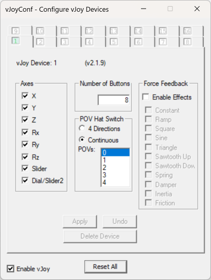

# Getting started

!!! danger "Using FFB devices for anything other than their intended purpose may result in damage or injury"
    The authors of Bonus FFB accept no liability for any loss or damage including, without limitation, indirect or consequential loss or damage arising out of or in connection with the use of the software. Use Bonus FFB at your own risk.

## Install vJoy

Install [vJoy v2.2.2.0](https://github.com/BrunnerInnovation/vJoy/releases/tag/v2.2.2.0).

Run the "Configure vJoy" application. Set up at least one virtual device with a minimum of 16 buttons, and click the "Enable vJoy" checkbox:

{: style="height:551;width:416px"}

## Install optional telemetry plugins

### American Truck Simulator/Euro Truck Simulator 2

Install [RenCloud's scs-sdk-plugin](https://github.com/RenCloud/scs-sdk-plugin/releases) DLL to the `bin\win_x64\plugins` folder of your ATS and ETS2 installations. These are the default locations when using Steam:

* `C:\Program Files (x86)\Steam\steamapps\common\American Truck Simulator\bin\win_x64\plugins\`
* `C:\Program Files (x86)\Steam\steamapps\common\Euro Truck Simulator 2\bin\win_x64\plugins\`

??? tip "When installed correctly, ATS/ETS2 will start with a notice that the SDK has been activated."
    Unfortunately this message cannot be deactived, you will have to press OK each time the game is launched.

## Configure your FFB joystick

Follow the [device settings guide](device-settings.md) for your specific FFB joystick.

!!! warning "Some FFB joysticks will silently fail to work with Bonus FFB until correctly configured."

## Install and configure Bonus FFB

Download and run the latest [Bonus FFB installer](https://github.com/kgmonteith/BonusFFB/releases).

Bonus FFB installs as a single application with a few modes:

* [H-pattern shifter](hshifter.md) for simulating manual transmissions
* ["PRNDL"-style shifter](prndl.md) for simulating automatic transmissions
* A simple [handbrake](handbrake.md) lever

Select your desired mode and open the `Input/output settings` tab. Select your FFB joystick and other devices as required by the application. Select the vJoy device you configured earlier. Choose `File > Save device settings` when you're happy with the device and axis settings.

If your FFB joystick and other devices are correctly detected and configured, you can start the app by pressing the ▶️ button.

Please read the application's guide for app-specific configuration, options, and features.

If you'd like other modes or have ideas for Bonus FFB, reach out on [Discord :fontawesome-brands-discord:](https://discord.com/users/447499151337324574) or [Github :fontawesome-brands-github:](https://github.com/kgmonteith/BonusFFB/issues).
