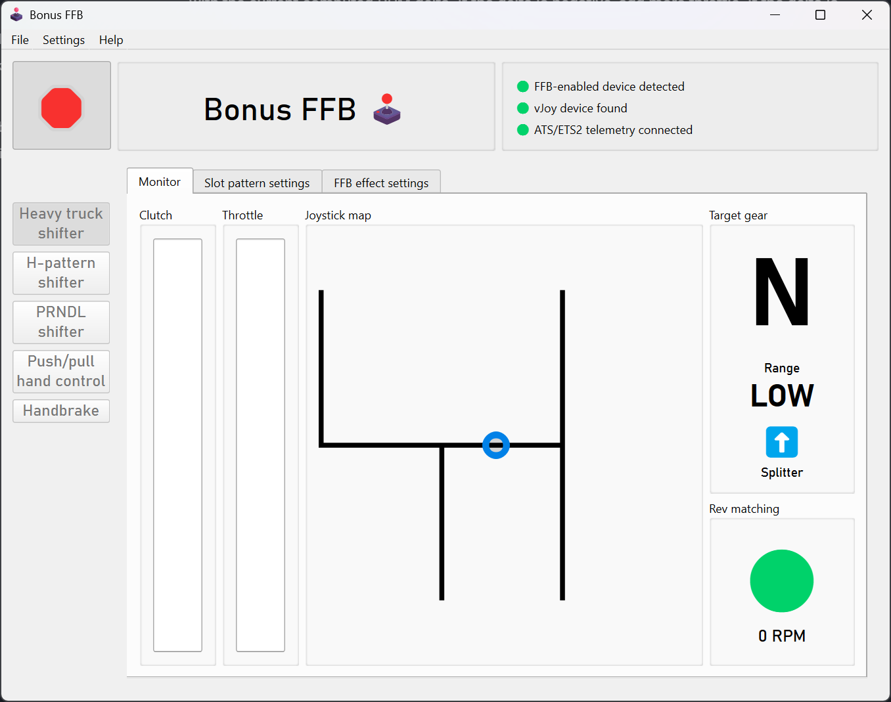
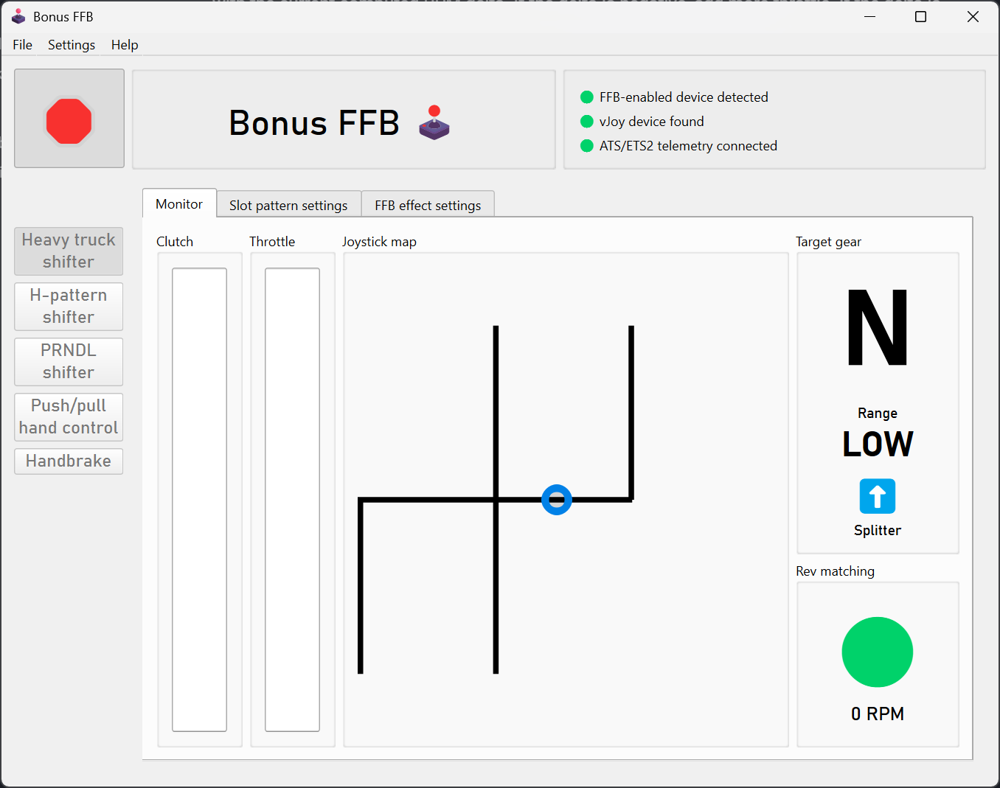
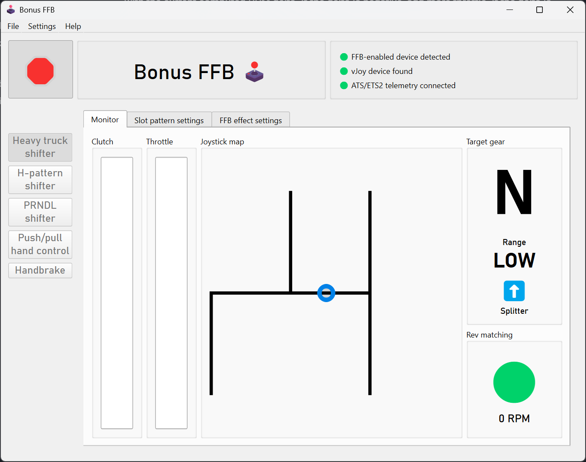
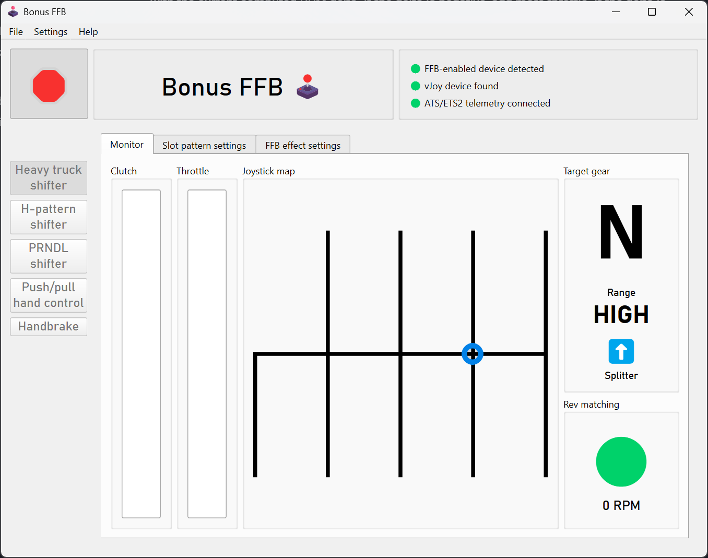
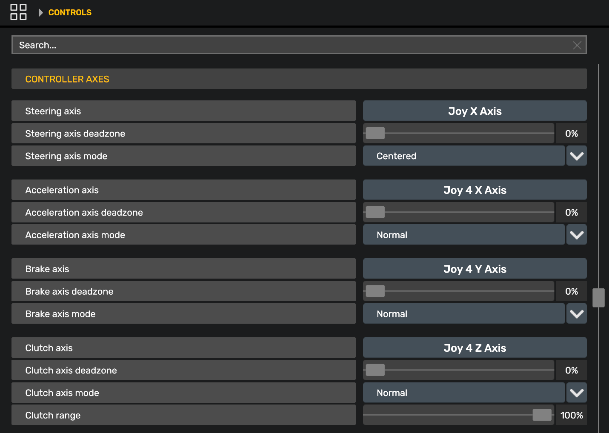

# Heavy truck shifter

The heavy truck mode was built to simulate an Eaton-Fuller 18-speed heavy truck transmission. It was designed and tuned using feedback from truckers with 30 years of experience driving manual transmission trucks. Tremendous thanks to Kyle Darling for the insights that made this mode possible, and to Exius86 and amagawd for their testing and input.

All stock shifter layouts in ATS and ETS2 are supported, plus a special bonus ZF-16 Double-H slot pattern.

The heavy truck mode features rev-matching effects to enable tactile float shifting, customizable slot patterns, throttle-on shifting, and more.

 

## Demo video

<iframe width="560" height="315" src="https://www.youtube.com/embed/jpJpm_i2g7c?si=2uIfv2SdnJ3C_SHS" title="YouTube video player" frameborder="0" allow="accelerometer; autoplay; clipboard-write; encrypted-media; gyroscope; picture-in-picture; web-share" referrerpolicy="strict-origin-when-cross-origin" allowfullscreen></iframe>

## Features

> *"Most sims treat truck transmissions like a heavy car shifter (spring + click). That’s wrong. An Eaton 18-speed is an industrial control interface. It is viscous, unforgiving, and communicative. To mimic an Eaton RT-18, the FFB needs to prioritize friction and texture over spring force. I need to feel the torque clamping the stick, the 'saw blade' effect of the gear teeth when I miss a shift, and the physical 'clunk' of the range change air-piston transferring through the handle."*

The heavy truck mode implements effects and features found in American heavy-duty dog box truck transmissions. It's still a work in progress, and feedback is appreciated.

!!! Warning
    The heavy truck mode relies on ATS/ETS2 telemetry to function. It will not behave correctly without it, or when the game is paused or not running. This is expected behavior.

### Float shifting and gear grinding

[Float shifting](https://en.wikipedia.org/wiki/Float_shifting) is more strictly controlled by only allowing the stick to fully slot into gear when the engine's output shaft is synchronized with the transmission's input shaft. This is done by computing the difference between the engine's RPMs and the transmission's RPMs, which we call the RPM delta, or rev matching. If the RPM delta is too high, the shifter stick will not be allowed into the gear slot, and a gear grinding effect will play&mdash;faster and stronger for a large RPM delta, slower and weaker when the gears are nearly synchronized. This provides tactile feedback to determine how much throttle needs to be applied to achieve synchronization. No more staring at the tachometer to float shifts, you can actually *feel* it!

The "Rev matching" indicator provides a visual cue of when float shifting is permitted, along with the current computed RPM delta. If the delta is negative, add more throttle. If the delta is positive, reduce throttle.

You can tune the maximum allowed RPM delta for float shifting in the FFB effect settings, making floating shifts easier or harder.

### Customizable slot patterns

The heavy truck mode includes slot patterns for all standard shifter layouts in ATS and ETS2&mdash;Eaton-Fuller, Scania, Volvo, and ZF. Blocked slots are actually blocked, and you can quickly change between different patterns. No more dead-sticking into the wrong slot!

- <figure markdown="span">
    { width="300" }
    <figcaption>Scania 12</figcaption>
  </figure>
- <figure markdown="span">
    { width="300" }
    <figcaption>Volvo 12</figcaption>
  </figure>
- <figure markdown="span">
    { width="300" }
    <figcaption>ZF 12</figcaption>
  </figure>
- <figure markdown="span">
    { width="300" }
    <figcaption>ZF 16 Double-H</figcaption>
  </figure>

To support stick extensions, the heavy truck mode has configurable slot depths, pattern widths, and pattern alignment.

There's also an extra-special, old-school [ZF-16 Double-H pattern](https://www.scribd.com/document/421805601/245068800-ZF-Double-H-Shift-Pattern-pdf), fully compatible with the ZF-16 shifter layout in ETS2. The range switch is not used; instead, the range is changed by [bumping the stick between the two patterns](https://www.youtube.com/watch?v=ggJv-Rj5_dA).

### Torque lock

When a real truck is in gear and the transmission is loaded (e.g., the throttle is pressed), it's not physically possible to move the stick out of gear. The heavy truck mode simulates this effect by applying a heavy counter-force if the stick is pushed towards neutral while in gear and throttle is applied. The mode uses telemetry values to set the effect, so it also applies when using cruise control. A lighter amount of torque lock is also applied any time the transmission is in gear and the wheels are moving.

### The left-slot "wall"

On an RT-18 transmission, the regular drive gears are available in the center and right slots. The "low" and "reverse" gears are on the left slot. To protect from mis-shifts, or maybe even for mechanical reasons, a strong "wall" of force needs to be overcome in order to move the shifter into the left slot.

The wall effect is also applied on other slot patterns with a similar reverse/low layout.

### Throttle-on shifting

In a real manual transmission truck, it's possible to float gears while applying the throttle. This is particularly useful for downshifting and hill climbing. ATS and ETS2 do not natively support throttle-on shifting; the throttle must be completely released in order to float gears.

Bonus FFB adds support for throttle-on shifting by mapping your pedal axes onto virtual axes, detecting when a throttle-on shift should be allowed in real life, and momentarily cutting off the virtual throttle output. This throttle "un-blip" is only 10 milliseconds, completely undetectable when driving, but long enough to trick the game into recognizing the shift.

## Game configuration

### Basic game settings

First, install the [required ATS/ETS2 telemetry plugin](setup-guide.md#3-install-telemetry-plugins).

Start the heavy truck mode, then set these values in the "Controls" menu:

* In the `Input Types` list, add the vJoy Device. In this example, vJoy Device is the fourth entry, so it will show up as Joy 4 in the control bindings.
 
* Set `Transmission` to `H-Shifter`
* Set `Shifter layout behavior` to `Advanced`
* Set `Shifter Positions` 1-6 to the vJoy Device buttons 0-5, corresponding to the shifter slots
    * Simply walk the shifter through the slots to bind each gear while Bonus FFB is running, as you would a hardware shifter.
    * If you have trouble binding buttons while in heavy truck mode, bind them using [H-shifter mode](hshifter.md) instead. The same button numbers are used by both modes.
    * Ignore the `Reverse` position, it's not used when the `Shifter layout` matches a real transmission
* Set the `Shifter layout` to match the transmission of your truck,  e.g., Eaton-Fuller 18 speed. In Bonus FFB, choose the matching slot pattern in the slot pattern settings tab.
    * ⚠️ Remember to change this setting when you change trucks or transmissions!

### Advanced game settings

Some advanced features, like throttle-on shifting and the ZF-16 Double-H pattern, work by duplicating your devices' outputs on corresponding vJoy outputs, and modifying the values when appropriate.

To use these features, you will need to bind the vJoy axes and buttons in the game's control settings. To do so, remove your physical pedals and range/splitter as an input in the game's "Controls" menu by selecting them in the "Input type" list and choosing "None". Then rebind the below axes and buttons (while Bonus FFB is running) as you would normally, by pressing the corresponding axis or button. This will cause the game to recognize the vJoy device as the control source.

* Bind the range and splitter buttons as shown in the screenshot above.
* Bind the acceleration, brake, and clutch axes as shown below.

(This will work even if your pedals are connected to your steering wheel, just be sure to add your steering wheel back to the "Input type" list after binding the pedal axes.)

## Settings descriptions

### Slot pattern settings

Changes to the slot pattern, position, slot depth, and width are reflected on the joystick map, consult it after making a change.

- **Slot pattern**: Select the pattern that matches your truck's transmission, *and* the shifter layout in the game's controls menu.
- **Grind zone depth:** Adjusts how far into the slot you have to push the stick to trigger the transmission grinding effect, shown with a red line when the markers are enabled. The grind zone should always be between the button zone and the neutral slot.
- **Button zone depth:** Adjusts how far into the slot you have to push the stick to trigger the button press, shown with a blue line when markers are enabled. Increasing this value means you will need to push the stick farther into the slot to trigger the shift button press. Tune it such that float shifting only occurs when revs are matched and the stick is allowed to move sufficiently far into the slot, about 20% higher than the grind zone value is recommended.

### Force feedback effect settings

- These static effect settings apply at all times:
    - **Damper:** Adds resistance proportional to joystick movement speed
    - **Inertia:** Opposes changes in joystick velocity, adding "weight" to the stick
    - **Friction:** Adds constant resistance, regardless of joystick motion
    !!! Warning
        For Moza bases, these values are *added* to the corresponding values in Moza Cockpit, they do not override them.
    !!! Info
        New Eaton-Fuller transmissions tend to feel "weighty", increase these settings to simulate a new transmission. Older transmissions tend to feel "looser" with a stick that's easier to move.
- **Gate latch friction:** A friction effect that plays when passing through a slot gate latch, simulating the shift fork engaging the synchronizer collar
    - This value is added to the constant friction resistance&mdash;e.g., 30% constant friction + 40% gate latch friction results in 70% total friction for the effect.
- **Grind effect intensity:** Sets the strength of the gear grinding effect. This effect plays when attempting to shift into gear without the clutch applied and the RPM delta is too high.
- **Grind effect shape:** Changes the effect shape of the grind effect. 'Triangle' is recommended to simulate the most realistic feel.
- **Idle torque lock strength:** When in gear, the torque lock effect pushes the shifter back into the slotted position. This setting adjusts the strength of the effect when throttle is *not* applied. Think of it as the minimum amount of force you need to move the stick from a slotted gear back to neutral.
- **Torque load effect strength:** When in gear, this effect applies a subtle force proportional to throttle application. This simulates the gear teeth clamping under torque and holding the gear.
- **Engine vibration strength:** Sets the strength of the engine vibration effect. This effect should be subtle; high values could result in the shifter stick thrashing wildly.
- **Max RPM delta for float shift:** Changes the allowable RPM delta range for float shifts. A larger value permits a greater mismatch between the engine and transmission RPMs, making float shifting easier and more permissive. A smaller value makes float shifting more strict and challenging.