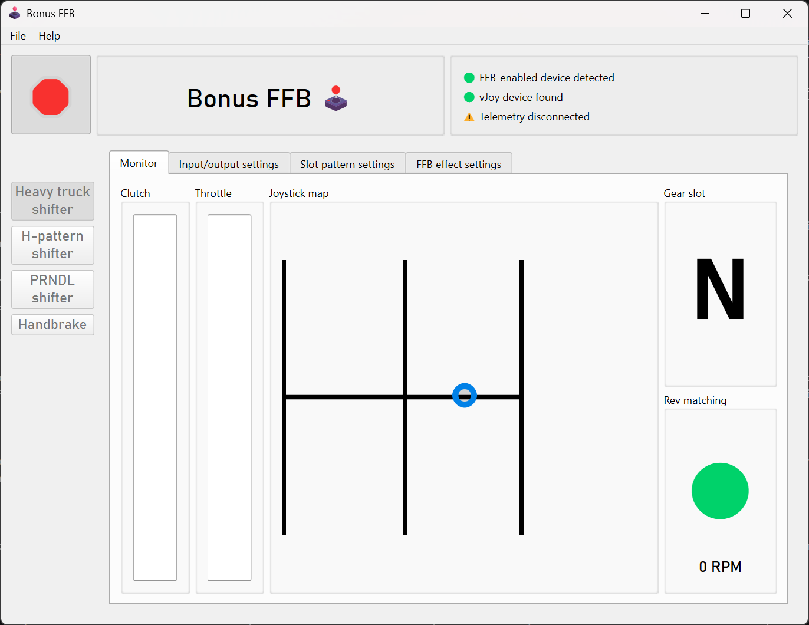
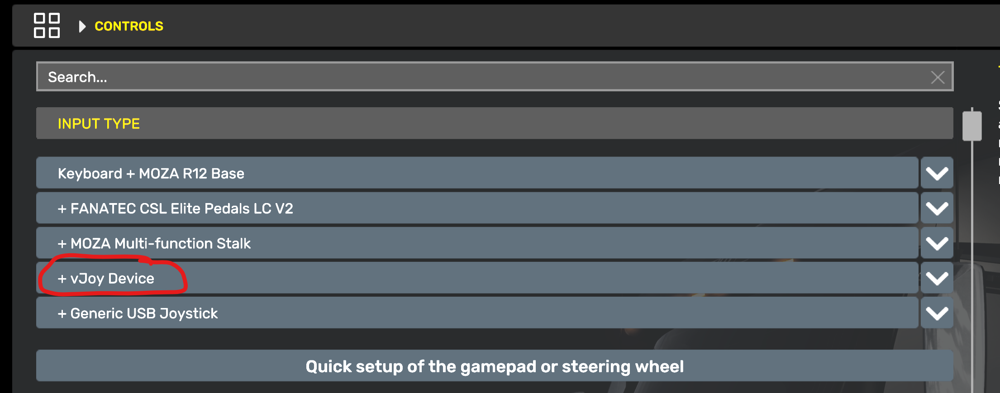
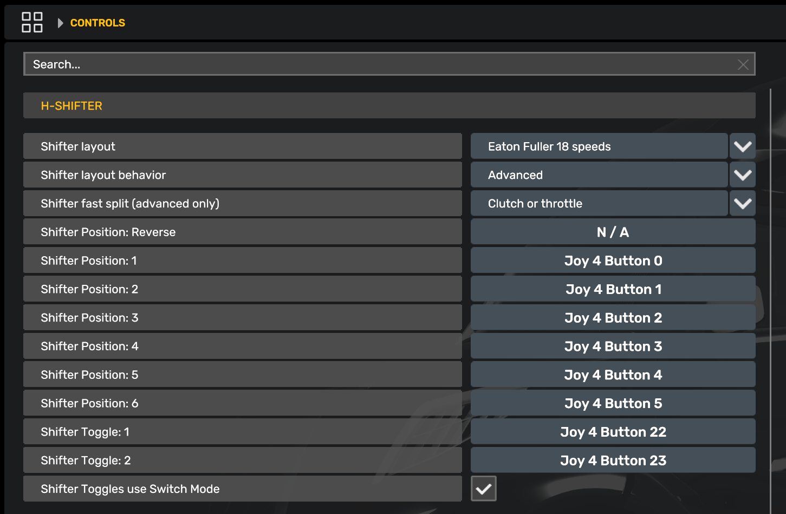

# Heavy truck shifter

The heavy truck mode simulates an Eaton-Fuller 18-speed heavy truck transmission. It was designed and tuned based on feedback from truckers with 30 years of experience driving manual transmission trucks. Tremendous thanks to Kyle Darling for the insights that made this mode possible, and to Exius86 and amagawd for their testing and feedback.

The heavy truck mode was built specifically for American Truck Simulator. [Setting up telemetry](getting-started.md#2-install-telemetry-plugins) is required, it will not work without it.

The heavy truck mode features rev-matching effects to enable tactile float shifting, configurable slot throws to support joystick extensions, Eaton-Fuller specific slot layouts, and more.

 

## Features

> *"Most sims treat truck transmissions like a heavy car shifter (spring + click). That’s wrong. An Eaton 18-speed is an industrial control interface. It is viscous, unforgiving, and communicative. To mimic an Eaton RT-18, the FFB needs to prioritize friction and texture over spring force. I need to feel the torque clamping the stick, the 'saw blade' effect of the gear teeth when I miss a shift, and the physical 'clunk' of the range change air-piston transferring through the handle."*

The heavy truck mode implements effects and features found in American heavy-duty dog box truck transmissions. It's still a work in progress, and [feedback](https://github.com/kgmonteith/BonusFFB/issues) on the mode is appreciated.

!!! Warning
    The heavy truck mode relies on ATS/ETS2 telemetry to function. It will not behave correctly without it, or when the game is paused or not running. This is expected behavior.

### Float shifting and gear grinding

[Float shifting](https://en.wikipedia.org/wiki/Float_shifting) is more strictly controlled by only allowing the stick to fully slot into gear when the engine's output shaft is synchronized with the transmission's input shaft. This is done by computing the difference between the engine's RPMs and the transmission's RPMs, which we call the RPM delta, or rev matching. If the RPM delta is too high, the shifter stick will not be allowed into the gear slot, and a gear grinding effect will play&mdash;faster and stronger for a large RPM delta, slower and weaker when the gears are nearly synchronized. This provides tactile feedback to determine how much throttle needs to be applied to achieve synchronization. No more staring at the tachometer to float shifts, you can actually *feel* it!

The "Rev matching" indicator provides a visual cue of when float shifting is permitted, along with the current computed RPM delta. If the delta is negative, add more throttle. If the delta is positive, reduce throttle.

You can tune the maximum allowed RPM delta for float shifting in the FFB effect settings, making floating shifts easier or harder.

### Torque lock

When a real truck is in gear and the transmission is loaded (e.g., the throttle is pressed), it's not physically possible to move the stick out of gear. The heavy truck mode simulates this effect by applying a heavy counter-force if the stick is pushed towards neutral while in gear and throttle is applied. The mode uses telemetry values to set the effect, so it also applies when using cruise control. A lighter amount of torque lock is also applied any time the transmission is in gear and the wheels are moving.

### Configurable slot patterns

To support stick extensions, the heavy truck mode has configurable slot depths and slot channel positioning. The default slot pattern matches that of a real RT-18 and is intended to be used with an extension, but is also comfortable with direct-mounted truck shifter. Preset buttons are provided for the default Eaton Fuller pattern, and a pattern that utilizes the full range of your joystick base.

### The left-slot "wall"

On an RT-18 transmission, the regular drive gears are available in the center and right slots. The "low" and "reverse" gears are on the left slot. To protect from mis-shifts, or maybe even for mechanical reasons, a strong "wall" of force needs to be overcome in order to move the shifter into the left slot.

## Game configuration

The H-shifter mode sends vJoy button presses when gears are engaged. Bind the in-game gear slots as you would with a hardware H-pattern shifter, by walking through the gears slot-by-slot in the game control settings. The input device will show up as the vJoy device you selected in the heavy truck mode's input/output settings.

!!! Note
    If you have difficulty binding buttons while in heavy truck mode, bind them while using [H-shifter mode](hshifter.md) instead. The same button numbers are used by both modes.

### ATS/ETS2 settings

Install the [required ATS/ETS2 telemetry plugin](getting-started.md#2-install-telemetry-plugins), then set these values in the "Controls" menu.

* In the `Input Types` list, add the vJoy Device
 
* Set `Transmission` to `H-Shifter`
* Set `Shifter layout` to match the vehicle's transmission, e.g., Eaton-Fuller 18 speed
* Set `Shifter layout behavior` to `Advanced`
* Set `Shifter Positions` 1-6 to the vJoy Device buttons 0-5, corresponding to the H-Shifter slots
    * Ignore the `Reverse` position, it's not used when the `Shifter layout` matches a real transmission
    

(Your device number will be different than in the above screenshot)

### Recommended device configurations

TODO: Determine recommended pedal curves for emulating a heavy truck's clutch.

## Settings descriptions

### Slot pattern settings

- Changes to the slot depth and positions are reflected on the joystick map, consult it after making a change.
- **Button zone depth:** Adjusts how far into the slot you have to push the stick to trigger the button press. Increasing this value means you will need to push the stick farther into the slot to trigger the shift button press. Tune it such that float shifting only occurs when revs are matched and the stick is allowed to move sufficiently far into the slot.

### Force feedback effect settings

- These static effect settings apply at all times:
    - **Damper:** Adds resistance proportional to joystick movement speed
    - **Inertia:** Opposes changes in joystick velocity, adding "weight" to the stick
    - **Friction:** Adds constant resistance, regardless of joystick motion
    - !!! Warning
        For the Moza bases, these values are *added* to the corresponding values in Moza Cockpit, they do not override them.
    - !!! Note
        New Eaton-Fuller transmissions tend to feel "weighty", increase these settings to simulate a new transmission. Older transmissions tend to feel "looser" with a stick that's easier to move.
- **Grind effect intensity:** Sets the strength of the gear grinding effect. This effect plays when attempting to shift into gear without the clutch applied and the RPM delta is too high.
- **Grind effect shape:** Changes the effect shape of the grind effect. 'Triangle' is recommended to simulate the most realistic feel.
- **Idle torque lock strength:** When in gear, the torque lock effect pushes the shifter back into the slotted position. This setting adjusts the strength of the effect when throttle is *not* applied. Think of it as the minimum amount of force you need to move the stick from a slotted gear back to neutral.
- **Torque load effect strength:** When in gear, this effect applies a subtle force proportional to throttle application. This simulates the gear teeth clamping under torque and holding the gear.
- **Engine vibration strength:** Sets the strength of the engine vibration effect. This effect should be subtle, high values could result in the shifter stick thrashing.
- **Max RPM delta for float shift:** Changes the allowable RPM delta range for float shifts. A larger value permits a greater mismatch between the engine and transmission RPMs, making float shifting easier and more permissive. A smaller value makes float shifting more strict and challenging.