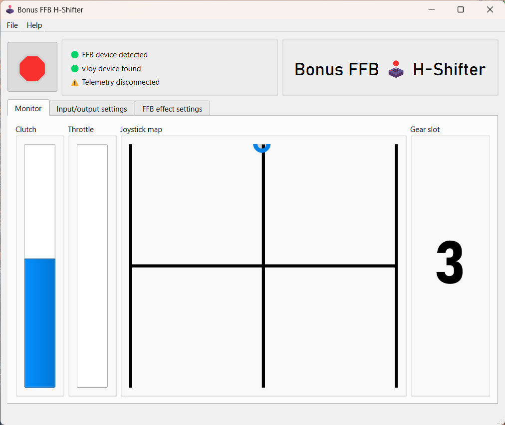

# H-Shifter

This mode simulates a basic H-pattern shifter with gate lock-out and gear grinding. The shift pattern layout, gear count, shifter throw, and overall pattern dimensions are configurable.

The H-shifter mode allows you to push through the gate lock-out effect and force the stick into gear. This allows to you use the mode as a dogbox shifter if desired. Otherwise, be mindful not to push through the lock-out effect.

SimHub telemetry is not yet supported but is planned.

 

## Features

Gate lockout is enforced by playing grinding and pushpack effects if the stick is slotted without depressing the clutch pedal.

When the throttle is engaged and the clutch is not, the shift lever will be locked in gear. You must release the throttle or depress the clutch in order to disengage the shifter.

## Game configuration

The H-shifter mode sends vJoy button presses when gears are engaged. Bind the in-game gear slots as you would with a hardware H-pattern shifter, by walking through the gears slot-by-slot in the game control settings. The input device will show up as the vJoy device you selected in the H-shifter mode's input/output settings.

## Settings descriptions

### Slot pattern settings

Changes to the slot pattern, position, slot depth, and width are reflected on the joystick map, consult it after making a change.

- **Slot pattern:** Select the pattern that matches your vehicles's transmission.
- **Pattern position:** Aligns the pattern to the left or right side of the joystick range.
- **Slot depth scale:** Adjusts the depth of the shifter slots. A smaller value results in a shorter shifter throw.
- **Pattern width:** Sets the maximum width of the shifter pattern. A smaller value restricts the left/right movement of the shifter. A value of 100% uses the full left/range of the joystick base. 
- **Neutral spring strength:** Sets the strength of the neutral centering spring effect, which is applied when the stick is near the neutral channel.
- **Neutral spring position:** Sets the centering position of the neutral spring. This is limited to positions under and between the center and rightmost slots in heavy truck mode, to prevent conflicts with the left-slot wall effect. This setting is ignored by the ZF-16 Double-H pattern, which overrides the neutral spring position for each of the two H-patterns.
- **Detent spring strength:** Sets the strength of the detent felt at the ends of the shifter slots.
- **Mechanical resistance:** Sets the strength of the spring force resisting the stick when it enters a gear slot until the detent is reached. This resistance must also be overcome when float shifting, so a low value is recommended.
- **Grind zone depth:** Adjusts how far into the slot you have to push the stick to trigger the transmission grinding effect, shown with a red line when the markers are enabled. The grind zone should always be between the button zone and the neutral slot.
- **Button zone depth:** Adjusts how far into the slot you have to push the stick to trigger the button press, shown with a blue line when markers are enabled. Increasing this value means you will need to push the stick farther into the slot to trigger the shift button press. Tune it such that float shifting only occurs when revs are matched and the stick is allowed to move sufficiently far into the slot; about 20% higher than the grind zone value is recommended.

### Force feedback effect settings

- These static effect settings apply at all times:
    - **Damper:** Adds resistance proportional to joystick movement speed
    - **Inertia:** Opposes changes in joystick velocity, adding "weight" to the stick
    - **Friction:** Adds constant resistance, regardless of joystick motion
- **Grind effect strength:** Sets the strength of the gear grinding effect. This effect plays when attempting to shift into gear without the clutch applied.
- **Grind effect RPM:** Sets the RPM of the gear grinding effect. This is currently a static value, it does not change with transmission RPMs.
- **Engine vibration intensity:** Sets the strength of the engine vibration effect. This effect is currently constant, it does not use telemetry to determine whether the engine is running.
- **Engine vibration RPM:** Sets the RPM of the engine vibration effect. This is currently a static value, it does not change with engine RPMs.
