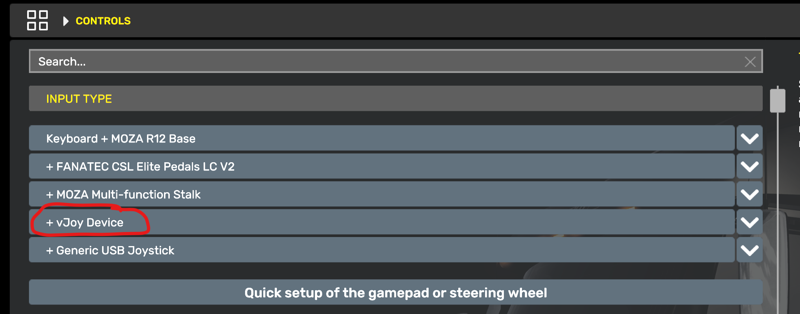

# PRNDL

This mode simulates an automatic gear shift lever, also known as a "PRNDL" shifter. It includes optional effects for locking the shifter in park or neutral, a configurable number of slots, and park gear simulation for ATS/ETS2.

 

## Features

Simply move the joystick forward and back to select the desired gear position.

* If a shift lock device is selected in the `Input/output settings` tab, the chosen button must be depressed in order to shift out of park. This simulates the shift lock trigger found on almost modern automatic vehicles to prevent accidentally shifting from park to reverse.
    * Similarly, if the `Enable shift lock between Neutral and Reverse` option is enabled, the button must be depressed to shift from neutral to reverse, which is also found on most automatic transmissions.
* ATS/ETS2 does not have a "park" gear. When ATS/ETS2 telemtry is enabled, "park" is simulated by enabling or disabling the parking brake and setting the gear to neutral. To enable this behavior, ensure the option is enabled in the `Other settings` tab.
    * Alternatively, the park gear can be disabled in the `Other settings` tab.

## Game configuration

The PRNDL mode sends vJoy button presses when gears are engaged. Bind the in-game gear slots as you would with a hardware automatic shifter, by walking through the gears slot-by-slot in the game control settings. The input device will show up as the vJoy device you selected in the PRNDL mode's input/output settings.

### ATS/ETS2 settings

Set these values in the "Controls" menu:

* In the `Input Types` list, add the vJoy Device
 
* Set `Transmission` to any automatic mode

Set these values in the "Keys and buttons" menu:

* Set `Shift To Drive` to vJoy button 10
* Set `Shift To Reverse` to vJoy button 8
* Set `Shift To Neutral` to vJoy button 9
* Set `Parking Brake` to vJoy button 7

## Settings descriptions

### Enable Park slot

This option enables the park slot. ATS/ETS2 does not have a park gear, so if you're not using telemetry, it's recommended to disable this option.

### Enable Low slot

Similar to the above, if your game of choice does not have a low gear, this option should be disabled.

### Simulate Park slot in ATS/ETS2 using parking brake telemetry

ATS/ETS2 does not implement a park gear in the game. When this option is enabled, and ATS/ETS2 telemetry is active, the PRNDL mode will simulate a park gear by enabling the parking brake and setting the gear to neutral. Disable this option if this behavior is not desired.

### Enable shift lock between Neutral and Reverse

When this option is enabled and a shift lock device and button are set in the `Input/output settings` tab, the shift lock button must be pressed in order to shift from neutral to reverse. (This is in addition to shift lock button's default behavior of preventing shifting from park to reverse.)