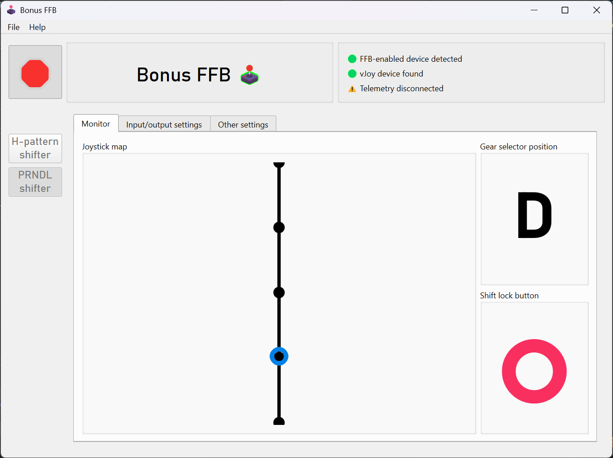
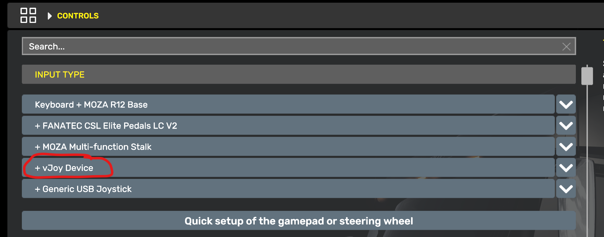
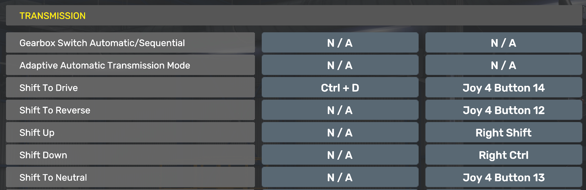

# PRNDL

This mode simulates an automatic gear shift lever, colloquially known as a "PRNDL" shifter. It includes optional effects for locking the shifter in park or neutral, a configurable number of slots, and park gear simulation for ATS/ETS2.

 

## Features

Simply move the joystick forward and back to select the desired gear position.

* If a shift lock device is selected in the `Input/output settings` tab, the chosen button must be depressed in order to shift out of park. This simulates the shift lock trigger found on all modern automatic vehicles to prevent accidentally shifting from park to reverse.
    * Similarly, if the `Enable shift lock between Neutral and Reverse` option is enabled, the button must be depressed to shift from neutral to reverse.
* ATS/ETS2 does not have a "park" gear. When ATS/ETS2 telemetry is enabled, "park" is simulated by enabling or disabling the parking brake and setting the gear to neutral. To enable this behavior, ensure the option is enabled in the `Other settings` tab.
    * Alternatively, the park gear can be disabled in the `Other settings` tab.

## Game configuration

The PRNDL mode sends vJoy button presses when gears are engaged. Bind the in-game gear slots as you would with a hardware automatic shifter, by walking through the gears slot-by-slot in the game's control settings. The input device will show up as the vJoy device you selected in the PRNDL mode's input/output settings.

### ATS/ETS2 settings

Set these values in the "Controls" menu:

* In the `Input Types` list, add the vJoy Device
 
* Set `Transmission` to any automatic mode

Set these values in the "Keys and buttons" menu. It's easiest to bind the buttons by starting with the stick in adjacent slot, starting the button bind detection, and then moving the stick into the target slot:

* Set `Parking Brake` to vJoy button 11
    * Disable the `Simulate Park slot in ATS/ETS2 using telemetry` setting in the "Other settings" tab in order to bind button 11, otherwise it will be overwritten by button 13
* Set `Shift To Drive` to vJoy button 14
* Set `Shift To Reverse` to vJoy button 12
* Set `Shift To Neutral` to vJoy button 13




??? info "How to manually set bindings in controls.sii"
    If you're comfortable editing the `controls.sii` file for you profile, you can also set the bindings by editing these entries, substituting `joy4` for your vJoy device number:

    ```
    config_lines[391]: "mix parkingbrake `keyboard.space?0 | joy4.b12?0 | semantical.parkingbrake?0`"
    config_lines[483]: "mix gear0 `unbound?0 | joy4.b14?0 | semantical.gear0?0`"
    config_lines[484]: "mix geardrive `modifier(cstm_mod_1?0 & (! cstm_mod_2?0) & (! cstm_mod_3?0) & (! cstm_mod_4?0) & (! cstm_mod_5?0) & (! cstm_mod_6?0), keyboard.d?0) || joy4.b15?0 | semantical.geardrive?0`"
    config_lines[485]: "mix gearreverse `unbound?0 | joy4.b13?0 | semantical.gearreverse?0`"
    ```

The PRNDL mode will also output your pedals' values on vJoy virtual axes, to preserve compatibility with the heavy truck and H-shifter modes.

## Settings descriptions

- **<span id="enable-park-slot">Enable park slot:</span>** This option enables the park slot. ATS/ETS2 does not have a park gear, so if you're not using telemetry, you may want to disable this option.
- **<span id="enable-low-slot">Enable Low slot:</span>** Similar to the above, if your game of choice does not have a low gear, this option should be disabled.
- **<span id="simulate-park-slot">Simulate Park slot in ATS/ETS2 using parking brake telemetry:</span>** ATS/ETS2 does not implement a park gear in the game. When this option is enabled and ATS/ETS2 telemetry is active, the PRNDL mode will simulate a park gear by enabling the parking brake and setting the gear to neutral. Disable this option if this behavior is not desired.
- **<span id="enable-shift-lock-between-neutral-and-reverse">Enable shift lock between Neutral and Reverse:</span>** When this option is enabled and a shift lock device and button are configured, the shift lock button must be pressed in order to shift from neutral to reverse. (This is in addition to the shift lock button's default behavior of preventing shifting from park to reverse.)
- **<span id="use-brake-pedal-as-additional-shift-lock">Use brake pedal as additional shift lock:</span>** When this option is enabled, the brake pedal must be pressed in order to shift from park or neutral to reverse.