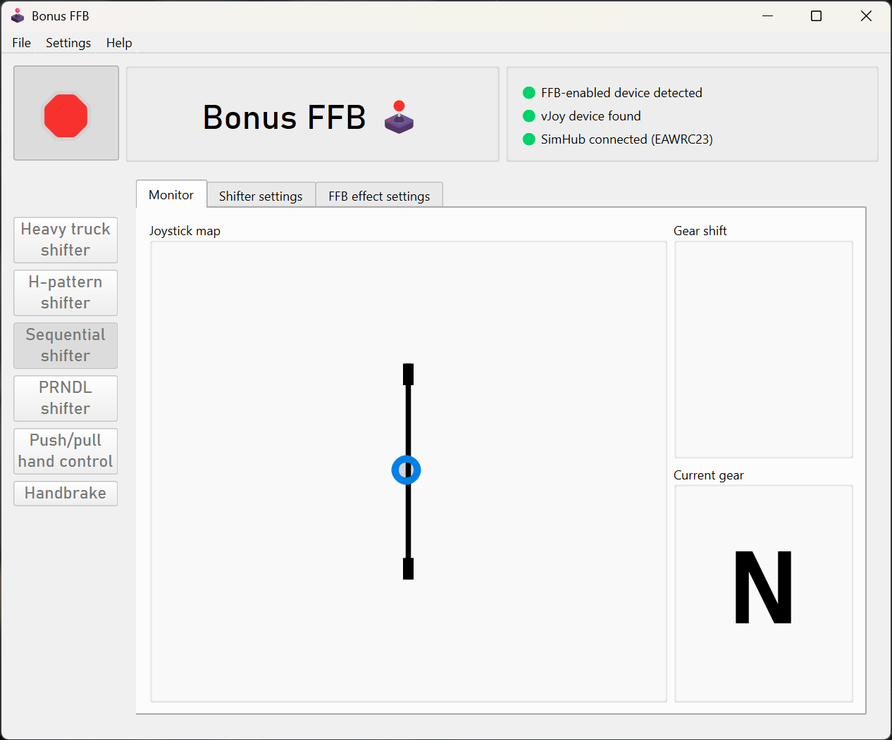

# Sequential shifter

This mode simulates a sequential shifter, most commonly used in rally and drift racing. Pushing the stick forward triggers a downshift, pulling back triggers an upshift. The shifter should be configured such that it quickly springs back to the center position after a shift.

## Features

When using SimHub telemetry, shifts are blocked beyond top and bottom of the gearbox range. Put simply, the app physically prevents you from shifting below R, or above the highest gear. The gearbox size is determined automatically from telemetry to match the active vehicle.

Without telemetry, the sequential shifter mode acts like a hardware sequential shifter, with unrestricted upshifts and downshifts.

## Compatibility

The sequential shifter is confirmed to be compatible with these rally games, including SimHub telemetry:

- EA SPORTS WRC
- BeamNG.drive

Assetto Corsa Rally is not currently supported due to the game's handling of force-feedback devices.

## Game configuration

The sequential shifter mode sends vJoy button presses when a shift is triggered. Bind the button presses to the shift up and shift down controls in-game, as you would with a hardware shifter.

## Settings descriptions

### Shifter settings

- **Shifter throw:** Sets the limits of the simulated shifter slot.
- **Detent size:** Sets the size of the detent effect at the end of the shifter slots. This also affects when a shift is triggered.
- **Centering spring strength:** Sets the strength of the always-on centering spring, which pulls the stick back to the center position. Set this such that the stick quickly springs out of the detents after a shift.
- **Detent spring strength:** Sets the strength of the detent felt at the end of the shifter slot.
- **Mechanical resistance:** Sets the strength of the spring force resisting the stick when it enters a gear slot until the detent is reached.

### Force feedback effect settings

- These static effect settings apply at all times:
    - **Damper:** Adds resistance proportional to joystick movement speed
    - **Inertia:** Opposes changes in joystick velocity, adding "weight" to the stick
    - **Friction:** Adds constant resistance, regardless of joystick motion