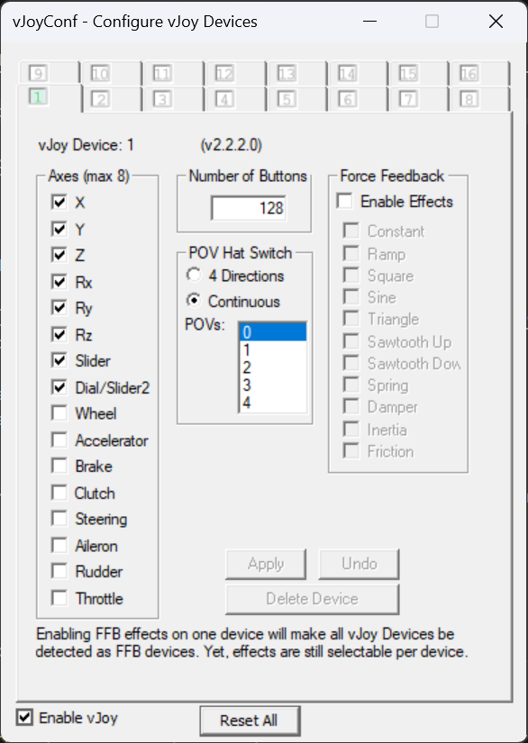
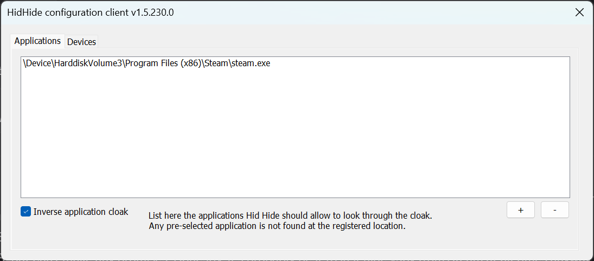
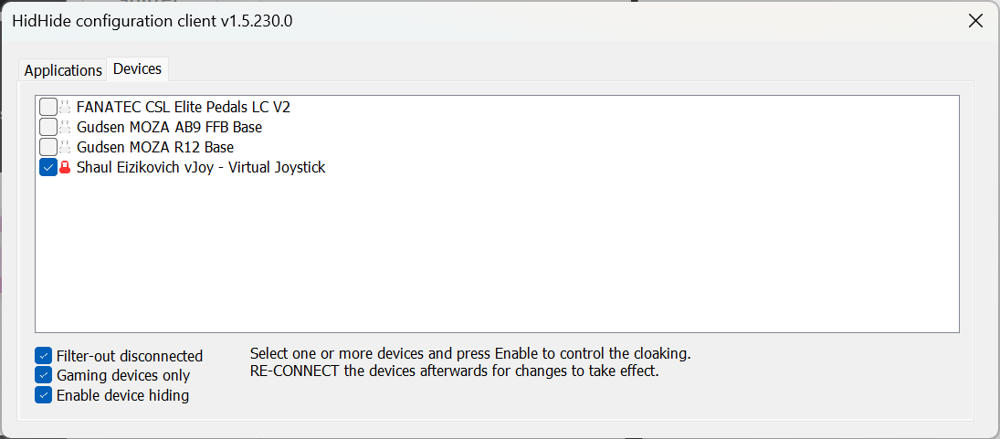
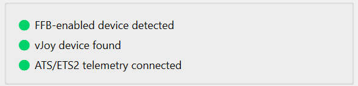
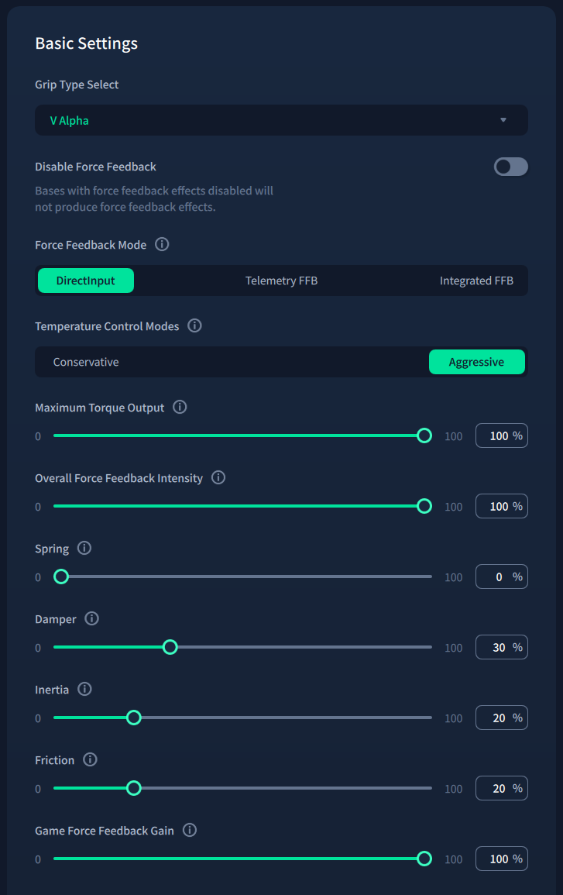

# Setup guide

!!! danger "Using FFB devices for anything other than their intended purpose may result in damage or injury"
    The authors of Bonus FFB accept no liability for any loss or damage including, without limitation, indirect or consequential loss or damage arising out of or in connection with the use of the software. Use Bonus FFB at your own risk.

To set up Bonus FFB, please follow these instructions in their entirety.

Armstrong Gaming created an excellent tutorial for installing Bonus FFB with troubleshooting tips, give it a watch if you're having trouble:

<iframe width="560" height="315" src="https://www.youtube.com/embed/1cJ69dylecg?si=Yl7EC97IAe13NFz8" title="YouTube video player" frameborder="0" allow="accelerometer; autoplay; clipboard-write; encrypted-media; gyroscope; picture-in-picture; web-share" referrerpolicy="strict-origin-when-cross-origin" allowfullscreen></iframe>

## 1. Install vJoy

Install [vJoy v2.2.2.0](https://github.com/BrunnerInnovation/vJoy/releases/tag/v2.2.2.0).

Run the "Configure vJoy" application. Set up at least one virtual device with a minimum of 32 buttons, and click the "Enable vJoy" checkbox:

{: style="height:551px;width:416px"}

## 2. Install and configure HidHide

Download and install [HidHide](https://github.com/nefarius/HidHide/releases).

Steam has introduced an incompatibility with vJoy that affects Bonus FFB and certain FFB wheelbases. [Set up](https://github.com/nefarius/HidHide#user-guide) HidHide with this configuration to block Steam from recognizing vJoy, then restart your PC:

## 3. Install telemetry plugins

### American Truck Simulator/Euro Truck Simulator 2

Install the x64 version of [RenCloud's scs-sdk-plugin](https://github.com/RenCloud/scs-sdk-plugin/releases) DLL to the `bin\win_x64\plugins` folder of your ATS and ETS2 installations. These are the default locations when using Steam:

* `C:\Program Files (x86)\Steam\steamapps\common\American Truck Simulator\bin\win_x64\plugins\`
* `C:\Program Files (x86)\Steam\steamapps\common\Euro Truck Simulator 2\bin\win_x64\plugins\`

When installed correctly and the ATS/ETS2 is running, Bonus FFB will show this status dashboard:

??? tip "When installed correctly, ATS/ETS2 will start with a notice that the SDK has been activated."
    Unfortunately this message cannot be deactivated, you will have to press OK each time the game is launched.

## 4. Configure your FFB joystick

=== "MOZA AB9/AB6"

    ??? warning "You must set `Force Feedback Mode` to `DirectInput`"
        If `Force Feedback Mode` is incorrect, Bonus FFB will silently fail to send force feedback commands to the base, resulting in a 'dead stick' effect.

    ??? warning "You must set `Base Force Model Selection` to `Flight Base`"
        Do NOT use the `Shifter` mode. The `Shifter` mode is for Moza's built-in shifter app and overrides Bonus FFB.

    <h3>MOZA Cockpit vs MOZA Pit House</h3>

    Download and install [MOZA Cockpit](https://support.mozaracing.com/en/support/solutions/articles/70000666515-moza-cockpit-download) if you don't already have it. These instructions apply to settings in MOZA Cockpit, which is distinct from MOZA Pit House.

    <h3>Required MOZA Cockpit settings</h3>

    First, ensure you have recently updated the firmware for your AB9/AB6 base.

    Under Basic Settings, change these settings:

    * `Force Feedback Mode` to `DirectInput`
    * `Maximum Torque Output` to `100%`
    * `Overall Force Feedback Intensity` to `100%`
    * `Spring` to `0`
    * `Game Force Feedback Gain` to `100%`

    `Damper`, `Inertia`, and `Friction` can be set according to personal preference. 20% strength is recommended as a minimum for safety reasons.

    Under Special, change these settings:

    * `Base Force Model Selection` to `Flight Base`

    !!! danger "Close and fully exit MOZA Cockpit after configuring these settings"
        Cockpit is not compatible with Pit House. Close Cockpit to avoid any interference from MOZA's built-in effects, and to avoid conflicts with other MOZA racing devices.

    

=== "Other FFB Joysticks"

    In theory, Bonus FFB is compatible with any powerful FFB joystick that...

    1. Supports DirectInput, which should be all of them
    2. Supports disabling centering spring effects

    This should include VPForce Rhino, FFBeast, etc., but has not been tested. If you have one of these devices and can help provide configuration instructions, please reach out via [GitHub :fontawesome-brands-github:](https://github.com/kgmonteith/BonusFFB/issues) or the #bonus-ffb channel on the [HOTAS Discord :fontawesome-brands-discord:](https://discord.gg/hotas).

## 5. Install and configure Bonus FFB

Download and run the latest [Bonus FFB installer](https://github.com/kgmonteith/BonusFFB/releases).

Configure your input and output devices in the `Settings > Configure input/output devices` menu. The ⚙️ button is shown if additional devices need to be configured to run the current mode.

* A force-feedback enabled joystick and vJoy are required for all Bonus FFB modes
* Pedals are required for the heavy truck and H-shifter modes
* Range and splitter switches are required for the heavy truck mode
    * The optional shifter accessory button is not used by Bonus FFB, but is provided to allow you to free up your shifter from using a USB slot in ATS/ETS2
* A shift lock device is optionally used by the PRNDL mode

Bonus FFB installs as a single application with a few modes:

* [Heavy truck shifter](heavytruck.md) for simulating heavy duty truck transmissions in ATS/ETS2
* [H-pattern shifter](hshifter.md) for simulating manual transmissions
* ["PRNDL"-style shifter](prndl.md) for simulating automatic transmissions
* [Push-pull hand control](pphc.md), simulating an assistive driving device for operating a vehicle's throttle and brakes with a single hand lever
* A simple [handbrake](handbrake.md) lever

Please read the mode's guide for app-specific configuration, options, and features.

If your FFB joystick and other devices are correctly detected and configured, you can start the app by pressing the ▶️ button.

If you're having trouble or have ideas for Bonus FFB, drop a message in the #bonus-ffb channel on the [HOTAS Discord :fontawesome-brands-discord:](https://discord.gg/hotas) or [GitHub :fontawesome-brands-github:](https://github.com/kgmonteith/BonusFFB/issues).